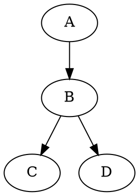
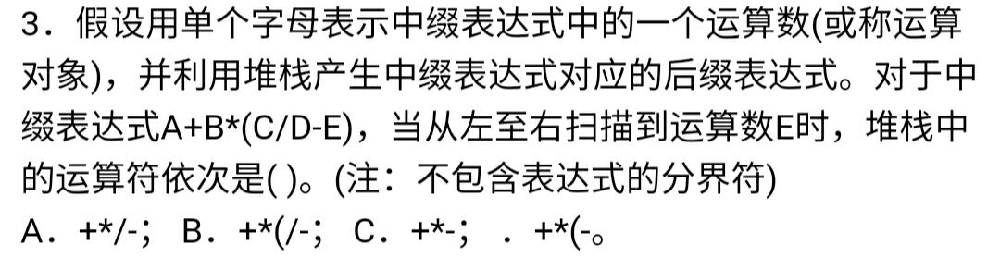

@import "includes/abbreviations.md"
@import "includes/footnotes.md"

--8<--
docs/includes/abbreviations.md
docs/includes/footnotes.md
--8<--

[TOC]

# Welcome to MkDocs

For full documentation visit [mkdocs.org](https://www.mkdocs.org).


## Commands

* `mkdocs new [dir-name]` - Create a new project.
* `mkdocs serve` - Start the live-reloading docs server.
* `mkdocs build` - Build the documentation site.
* `mkdocs -h` - Print help message and exit.

## Project layout

    mkdocs.yml    # The configuration file.
    docs/
        index.md  # The documentation homepage.
        ...       # Other markdown pages, images and other files.

!!! note
!!! abstract
!!! question
!!! warning
!!! danger
!!! hint
!!! success
!!! failure
!!! info
!!! bug
!!! example
!!! quote

!!! note
    Lorem ipsum dolor sit amet, consectetur adipiscing elit. Nulla et euismod
    nulla. Curabitur feugiat, tortor non consequat finibus, justo purus auctor
    massa, nec semper lorem quam in massa.

??? success
    Lorem ipsum dolor sit amet, consectetur adipiscing elit. Nulla et euismod
    nulla. Curabitur feugiat, tortor non consequat finibus, justo purus auctor
    massa, nec semper lorem quam in massa.

!!! info inline end

    Lorem ipsum dolor sit amet, consectetur
    adipiscing elit. Nulla et euismod nulla.
    Curabitur feugiat, tortor non consequat
    finibus, justo purus auctor massa, nec
    semper lorem quam in massa.

=== "C"

    ``` c
    #include <stdio.h>

    int main(void) {
      printf("Hello world!\n");
      return 0;
    }
    ```

=== "C++"

    ``` c++
    #include <iostream>

    int main(void) {
      std::cout << "Hello world!" << std::endl;
      return 0;
    }
    ```

=== "Python"

    ``` python
    print("Hello world!")
    ```


{>> ssssadsa <<}
{++asasd++}
{~~ sdsadasdasd ~> sasdsa ~~}

==sadasd==

The HTML specification
is maintained by the W3C.

The HTML specification is maintained by the W3C.

## 代码运行
```python {cmd, hide}
a = 1
b = 2
print(a + b)
```

```gnuplot {cmd, output="html", hide=true}
set terminal svg
set title "Simple Plots" font ",20"
set key left box
set samples 50
set style data points

plot [-10:10] x*sin(x)
```




```ditaa {cmd=true args=["-E"]}
  +--------+   +-------+    +-------+
  |        | --+ ditaa +--> |       |
  |  Text  |   +-------+    |diagram|
  |Document|   |!magic!|    |       |
  |     {d}|   |       |    |       |
  +---+----+   +-------+    +-------+
      :                         ^
      |       Lots of work      |
      +-------------------------+
  ```


  | Method      | Description                          |
| ----------- | ------------------------------------ |
| `GET`       | :material-check:     Fetch resource  |
| `PUT`       | :material-check-all: Update resource |
| `DELETE`    | :material-close:     Delete resource |


++ctrl+alt+del++

Lorem ipsum[^1] dolor sit amet, consectetur adipiscing elit.[^2]

[Subscribe to our newsletter](#){ .md-button }


`Lorem ipsum dolor sit amet`

:   Sed sagittis eleifend rutrum. Donec vitae suscipit est. Nullam tempus
    tellus non sem sollicitudin, quis rutrum leo facilisis.

`Cras arcu libero`

:   Aliquam metus eros, pretium sed nulla venenatis, faucibus auctor ex. Proin
    ut eros sed sapien ullamcorper consequat. Nunc ligula ante.

    Duis mollis est eget nibh volutpat, fermentum aliquet dui mollis.
    Nam vulputate tincidunt fringilla.
    Nullam dignissim ultrices urna non auctor.


## 数据结构

@import "image/SJJG_1.jpg"
<!-- { align=left } -->
