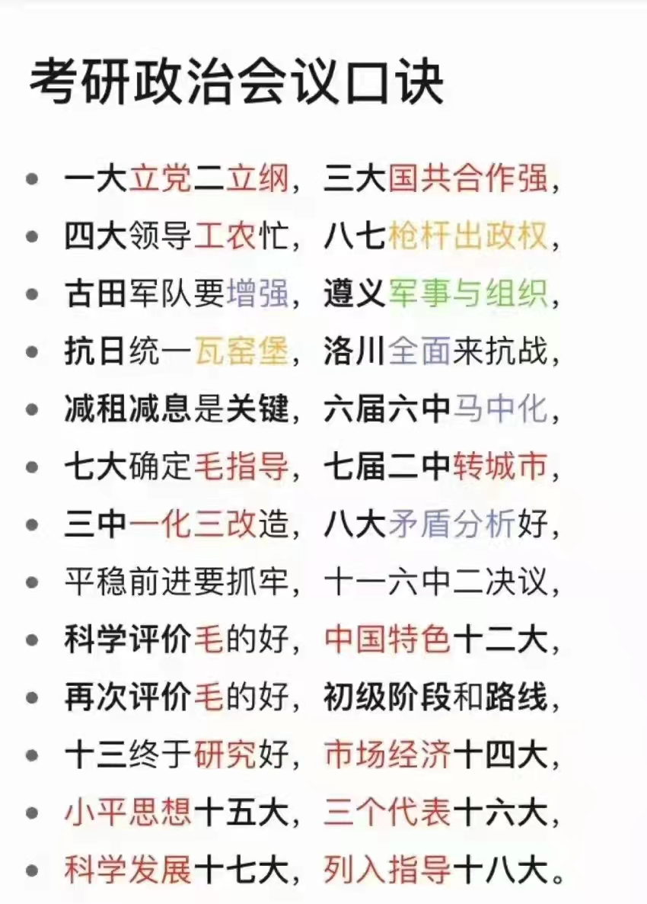

=== "会议"
    

    `中共一大`
    : 
        1. **建党**
        2. 反资
    
    `中共二大`
    : 
        1. **反帝反封建**
        2. 群众路线

    `中共三大`
    : 
        1. 党内合作

    `国民党一大`
    : 
        1. 新三民主义（共同纲领）
        2. 联俄、联共、扶助工农
        3. 标志第一次国共合作
    
    `八七会议`
    : 
        1. 清算陈独秀右倾机会主义错误
        2. 土地革命——中国资产阶级民主革命中心问题
        3. **枪杆子里出政权**
        > 评价：==挽救了党挽救了革命，生死攸关的转折点==
    
    `古田会议`
    : 
        1. 思想建党、政治建军；军队是执行政治任务的武装集团
        2. 建设党领导的新型人民军队
    
    `遵义会议`
    : 
        1. 解决军事问题、组织问题
        > 评价：==挽救了党挽救了红军挽救了革命，生死攸关的转折点==
    
    `瓦窑堡会议`
    : 
        1. 解决政治问题
        2. 提出抗日民族统一战线，使用“人民共和国”代替“工农共和国”
        3. 制定了“发展 进步势力 、争取 中间势力 、孤立 顽固势力（采用有理、有利、有节的原则）”的策略总方针
    
    `延安整风运动`
    : 
        1. 解决思想问题，==伟大的思想解放运动==
        2. 《改造我们的学习》：党的高级干部：反对 主观主义 整顿 **学风**（==重点==）
        3. 《整顿党的作风》：全党党员：反对宗派主义整顿 **党风**
        4. 《反对党八股》：全党党员：反对党八股整顿 **文风**
        5. 马克思主义思想路线成为全党共识
    
    `洛川会议`
    : 
        1. 实行全面的全民族抗战的路线
        2. 抗日救国十大纲领
    
    `中共六届六中全会`
    : 
        1. 首次提出：马克思主义中国化（《论新阶段》）
        2. 毛泽东撰写《《共产党人》发刊词》《中国革命和中国共产党》《新民主主义论》
        3. 系统阐明新民主主义理论
        4. 阐明了党在新民主主义革命阶段的基本纲领，标志着新民主主义革命的道路最终确立（《战争与战略问题》）
        5. 提出三个法宝：统一战线、武装斗争、党的建设
    
    `中共七大`
    : 
        1. 毛泽东思想写入党章
        2. 实现了马克思主义中国化的第一次飞跃
    
    
    `重庆政治协商会议（老政协）`
    : 
        1. 政府组织、国民大会、和平建国纲领、宪法草案、军事问题
        2. 国民党、共产党、各民主党派参与
    
    `中共七届二中全会`
    : 
        1. 提出迅速夺取全国胜利的方针
        2. 工作重心 **从乡村转移城市**
        3. 指出由农业国转变为工业国、由新民主主义社会转变为社会主义社会的总任务和主要途径
        4. 两个务必
    
    `北京政治协商会议（新政协）`
    : 
        1. 通过三大纲领：《中国人民政治协商会议组织法》《中华人民共和国中央人民政府组织法》《中国人民政治协商会议共同纲领》
        2. 《共同纲领》为临时宪法
    
    `中共八大`
    : 
        1. 国情变了（我国基本建立社会主义制度）
        2. 主要矛盾变化（人民对于经济文化迅速发展的需要同当前经济文化不能满足人民需要的状况之间的矛盾）
        3. 根本任务变了（解放生产力、发展生产力）
        4. 方针：坚持既反保守又反冒进即在综合平衡中稳步前进
        5. “三个主体、三个补充”
    
    `中共十一届三中全会`
    : 
        1. 重新确立解放思想、实事求是的思想路线

    `中共十一届六中全会`
    :
        1. 《 历史决议 》：提出毛泽东思想各个组成部分的立场、观点、方法是毛泽东思想活的灵魂——实事求是、群众路线、独立自主
        2. 提出了社会主义初级阶段这个概念

    `中共十二大`
    : 
        1. **中国特色社会主义** 成为我们党的全部理论和实践创新的主题
    
    `中共十三大`
    : 
        1. 系统阐明了我国社会主义初级阶段理论
        2. 一个中心、两个基本点（基本路线）
        3. 对 **中国特色社会主义理论** 做系统阐述
        4. 邓小平理论轮廓的形成（对中特理论做系统阐述是它的标志）
    
    `南方谈话`
    : 
        1. 邓小平理论逐步走向成熟
        2. 概括了社会主义本质：社会主义的本质，是解放生产力，发展生产力，消除剥削，消除两极分化，最终达到共同富裕。
    
    `中共十四大`
    : 
        1. 确定了建立社会主义市场经济体制的改革目标，提出“要使市场在社会主义国家宏观调控下对资源配置起基础性作用”
    
    `中共十五大`
    : 
        1. 邓小平理论写入党章
        2. 确定了基本经济制度：公有制为主体，多种所有制共同发展
    
    `中共十六大`
    : 
        1. “三个代表”重要思想写入党章
    
    `中共十七大`
    : 
        1. 提出了 **中国特色社会主义理论体系** 的概念
        2. 科学发展观写入党章
        
    
    